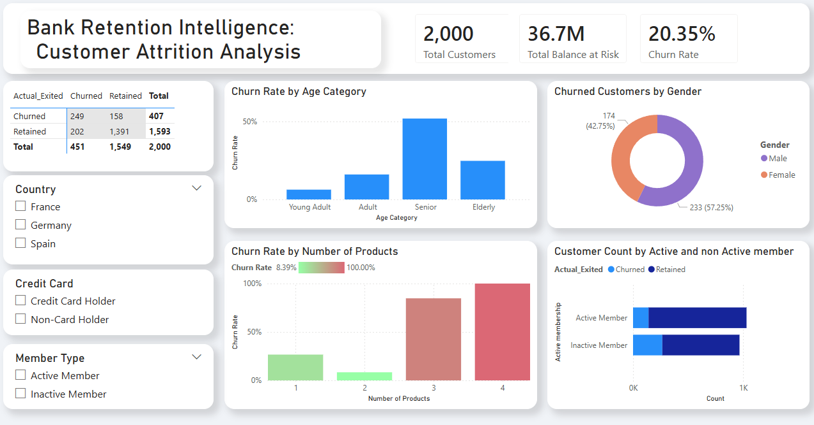
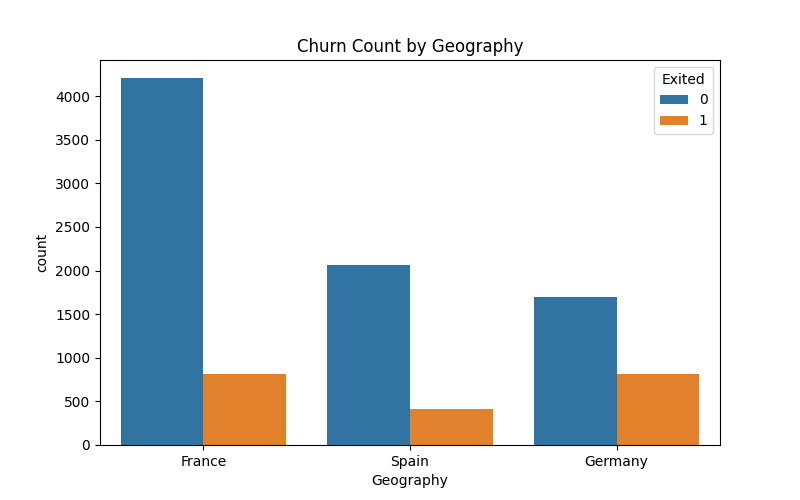
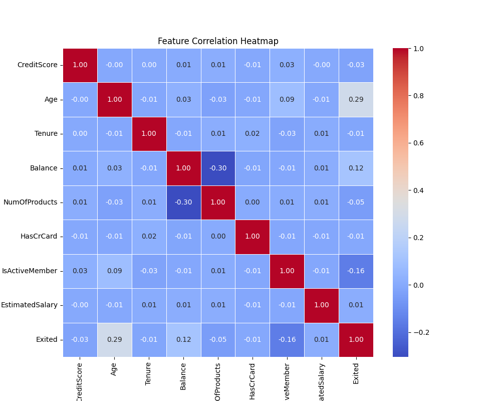

# 🏦 Bank Retention Intelligence: Customer Attrition Analysis

> An end-to-end ML pipeline and BI dashboard to predict customer churn and power data-driven retention strategies.


## 📌 Executive Summary

Customer attrition (churn) is one of the largest hidden costs in banking. This project delivers an end-to-end analytics solution to **identify high-risk customers before they leave** combining a modular Machine Learning pipeline with an interactive Power BI dashboard to move beyond prediction and surface actionable retention strategies.

## 🎯 Business Objectives

| Objective | Description |
|---|---|
| **Identify Attrition Drivers** | Discover which demographic and financial behaviors correlate most strongly with churn |
| **Predictive Modeling** | Build a robust ML model capable of handling imbalanced data to flag churners with high recall |
| **Actionable Intelligence** | Provide stakeholders with a dynamic dashboard to simulate churn impact and target campaigns |

## 🏗️ Project Architecture

The project is structured as a modular, production-style pipeline not a single monolithic notebook.

```
Churn_Modelling.csv
        │
        ▼
┌─────────────────┐     ┌──────────────────┐     ┌─────────────┐
│  data_loader.py │───▶│  engineering.py  │────▶│  model.py   │
│  (Ingestion +   │     │  (Feature        │     │  (XGBoost   │
│   EDA)          │     │   Engineering)   │     │   Training) │
└─────────────────┘     └──────────────────┘     └──────┬──────┘
                                                        │
                                                        ▼
                                          churn_predictions_output.csv
                                                        │
                                                        ▼
                                                ┌─────────────────┐
                                                │   Power BI      │
                                                │   Dashboard     │
                                                └─────────────────┘
```

### Module Breakdown

- **`data_loader.py`** Loads raw CSV data, drops non-predictive columns and auto-generates EDA visualizations saved to `plots/`
- **`engineering.py`** Transforms raw data into predictive signals:
  - Behavioral ratios: `Balance_Salary_Ratio` and `Tenure_Age_Ratio`
  - Bucketed variables: `Age_Group` and `Credit_Score_Range`
  - One-Hot and Label Encoding for categoricals
- **`model.py`** Trains an XGBoost classifier, uses `scale_pos_weight` to handle class imbalance (prioritizing **Recall**) and outputs `churn_predictions_output.csv`
- **`main.py`** Single entry point to run the full pipeline end-to-end

## 📊 Key Business Insights

### 🌍 Geographic Risk
Customers in **Germany** exhibit a significantly higher churn rate than those in France and Spain requiring immediate localized investigation.

### 👥 Demographic Peak
Attrition spikes sharply in the **"Senior" age bracket (45–60 years old)**. Retention campaigns should be tailored to this established demographic.

### 📱 The Engagement Shield
Analysis confirms that **Inactive Members** churn at an aggressively higher rate. Digital engagement and app usage are primary levers for reducing attrition.

### 📦 The Product Paradox
`NumOfProducts` ranks as a top feature importance predictor. Customers holding **3 or more products** show an alarming likelihood to exit suggesting product fatigue or poor multi-product service integration.

### 📊 Power BI Dashboard



> The interactive dashboard displays key KPIs (2,000 total customers, $36.7M balance at risk and 20.35% churn rate), churn breakdowns by age category, gender, number of products and active vs. inactive membership with slicers for country, credit card status and member type.

## 🔍 Exploratory Data Analysis

The pipeline auto-generates the following EDA plots into the `plots/` directory on each run.

### Churn Count by Geography


Germany stands out with a disproportionately high churn count relative to its retained customer base compared to France and Spain confirming it as the highest-risk geography.

### Feature Correlation Heatmap


The heatmap reveals that `Age` and `IsActiveMember` carry the strongest correlations with churn (`Exited`), with values of 0.29 and -0.16 respectively. Most other features show near-zero linear correlation indicating that non-linear models like XGBoost are well-suited for this problem.

## 📁 Repository Structure

```
bank-retention-intelligence/
│
├── Churn_Modelling.csv              # Raw dataset
├── churn_predictions_output.csv     # Model output for BI Dashboard
│
├── data_loader.py                   # Ingestion and EDA script
├── engineering.py                   # Feature transformation script
├── model.py                         # XGBoost training and evaluation
├── main.py                          # Pipeline execution entry point
├── requirements.txt                 # Python dependencies
│
├── plots/                           # Auto-generated EDA graphs
│   ├── churn_by_geography.png
│   └── correlation_heatmap.png
│
└── Bank Retention Analysis.pbip     # Power BI .pbix file
```

## 🛠️ Technology Stack

| Category | Tools |
|---|---|
| **Language** | Python 3.x |
| **Data Manipulation** | Pandas, NumPy |
| **Machine Learning** | Scikit-Learn, XGBoost |
| **Visualization** | Matplotlib, Seaborn |
| **Business Intelligence** | Power BI |

## 🚀 Getting Started

### 1. Clone the Repository
```bash
git clone https://github.com/maumau1x1/Bank-Retention-Intelligence-Data-Analytics.git
cd Bank-Retention-Intelligence-Data-Analytics
```

### 2. Install Dependencies
```bash
pip install -r requirements.txt
```

### 3. Run the Pipeline
```bash
python main.py
```

Running `main.py` will:
- ✅ Process and engineer features from the raw data
- ✅ Train the XGBoost churn prediction model
- ✅ Generate EDA plots in the `plots/` folder
- ✅ Output `churn_predictions_output.csv` for use in the Power BI dashboard

## 📈 Model Performance

The model prioritizes **Recall** to minimize false negatives (missed churners), using `scale_pos_weight` to address class imbalance in the training data. Evaluation metrics and the full classification report are printed to console on each pipeline run.
